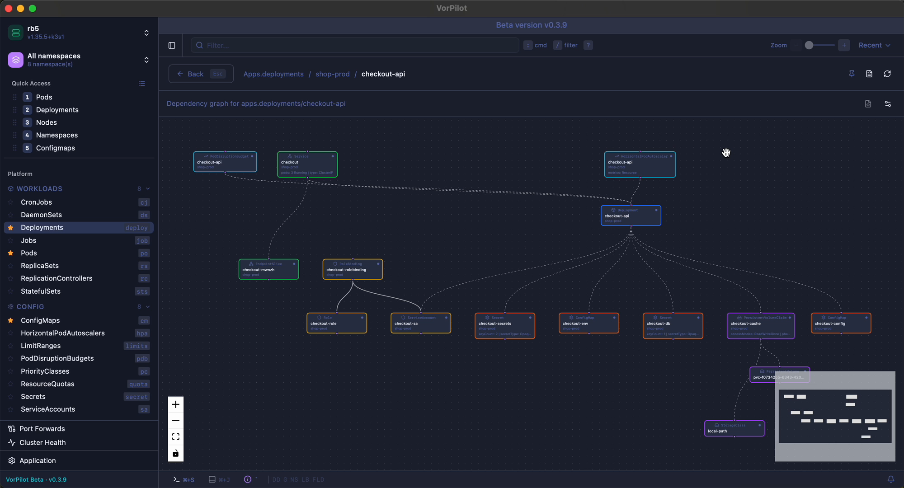
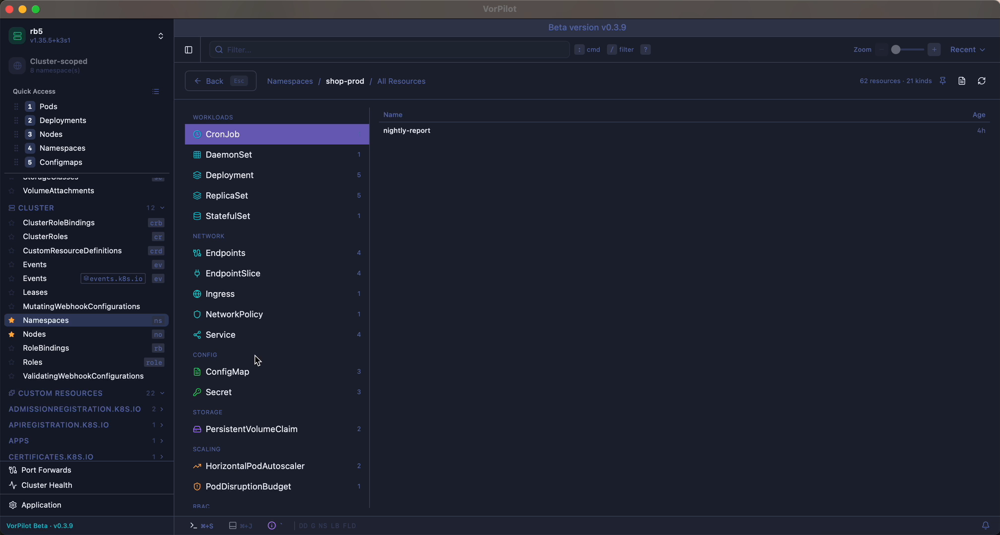
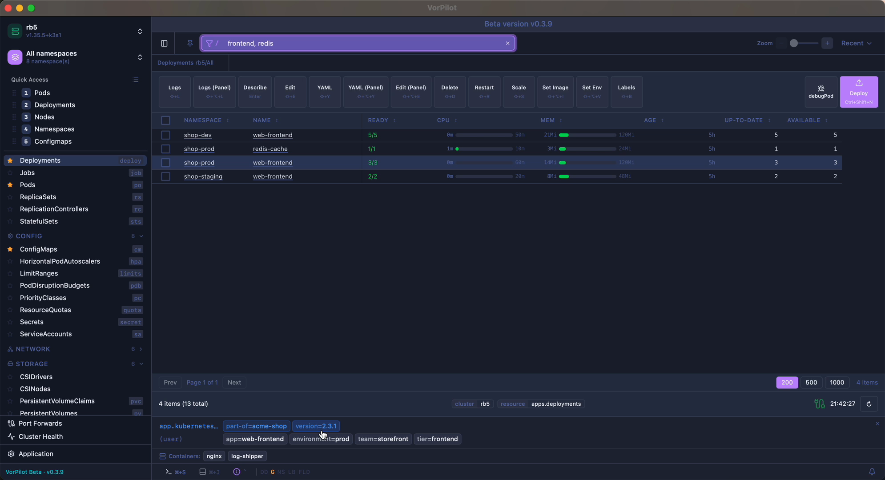
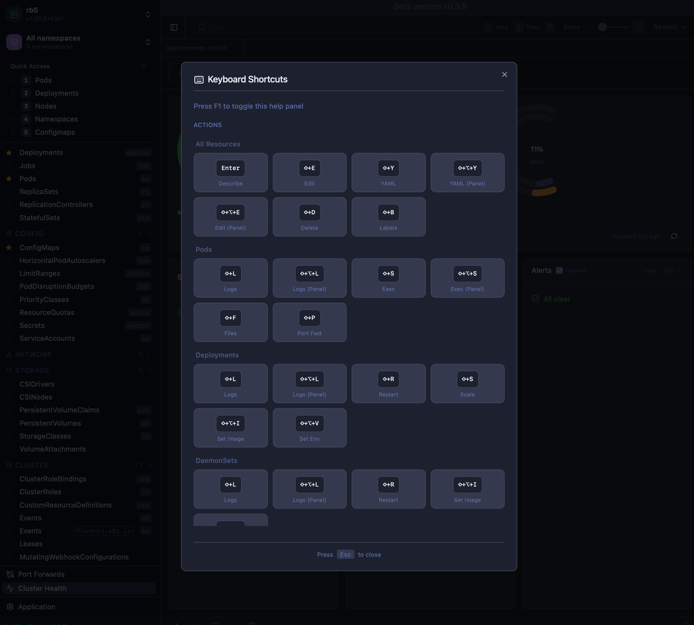
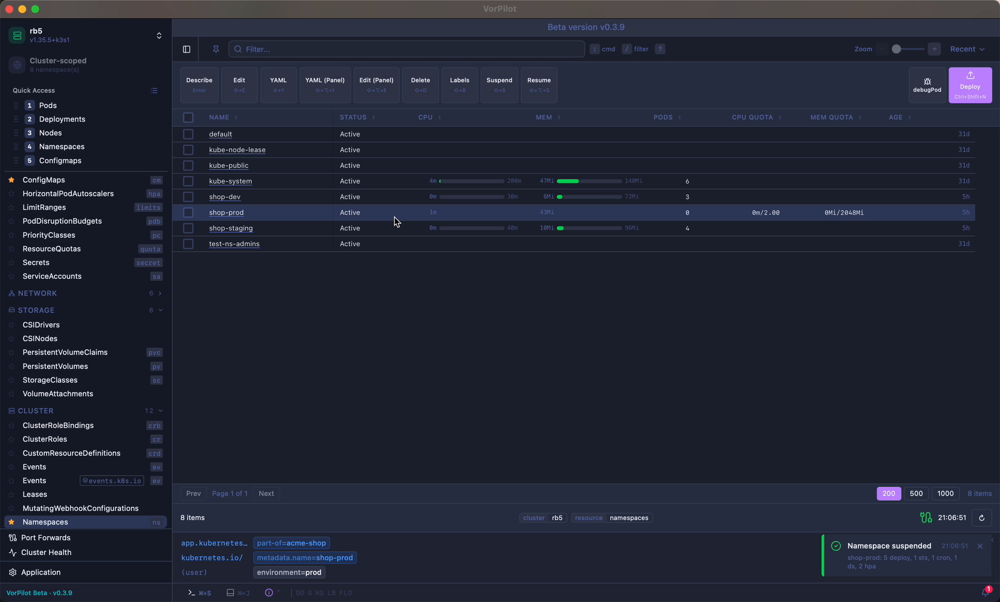
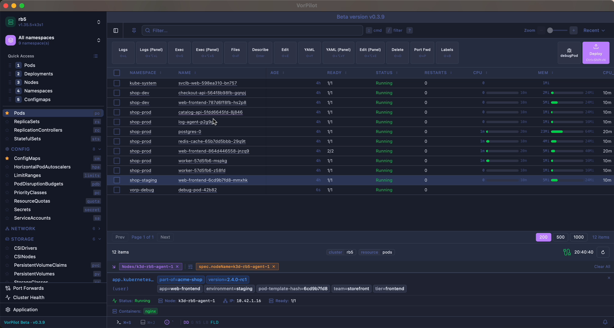
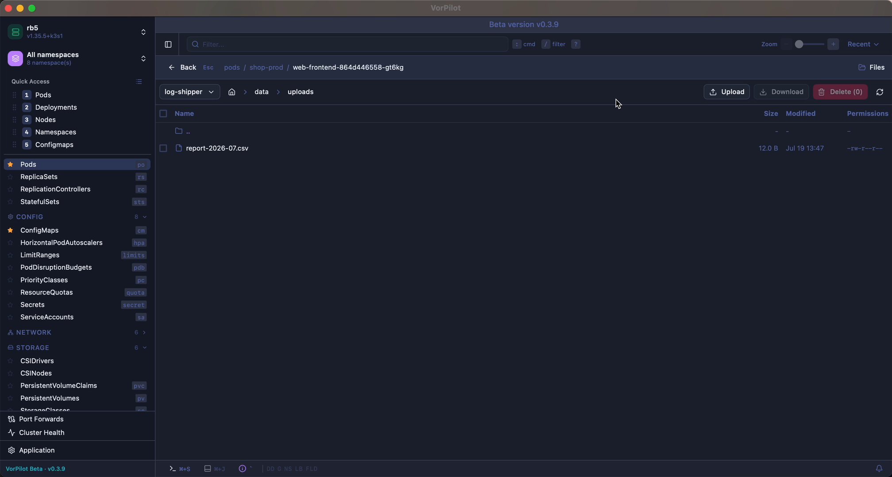
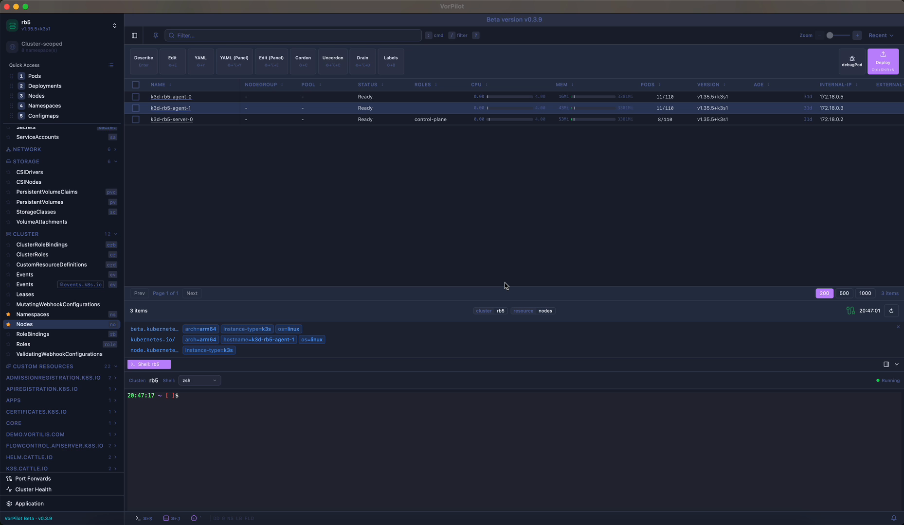

# VorPilot

### `kubectl`, but with hands.

A native **Kubernetes desktop client** — keyboard-driven, streaming-first, multi-cluster.
Lives between `k9s` and Lens, doing the ops both punt to a shell alias.

&nbsp;
&nbsp;
&nbsp;-6e6b85)
&nbsp;

**[Download](#download)** · **[Features](#features)** · **[Compare](#vorpilot-vs-the-shelf)** · **[Editions](#editions)** · **[FAQ](#faq)** · **[vortilis.com](https://vortilis.com)**

 

---

## Why VorPilot

`k9s` gave us keyboard muscle memory. Lens gave us scope — multi-cluster, CRDs, the whole API. VorPilot keeps both and adds the operations they punt to a shell: pause a whole namespace, X-ray a workload's real dependency graph, deploy from a manifest catalog in one keystroke, browse a container's filesystem, drop a privileged debug pod onto a node.

Native desktop — **no Electron, no browser tab**. macOS, Windows, and Linux. Every feature unlocked — no account, no license key.

## Highlights

- ⌨️ **A complete keyboard system** — command + filter modes, quick-access slots `1`–`9`, deploy macros, context-aware actions per kind (`⇧E` edit, `⇧L` logs, `⇧S` exec/scale). `F1` for the full map.
- 🕸️ **Resource topology** — pick any Deployment / Service / Pod and see its full dependency graph, auto-laid-out and color-coded by health, with optional network-policy checks.
- 🗂️ **Whole-namespace inventory** — every Kind in a namespace discovered and grouped on one pane, with live counts and one-click drill-in.
- ⏸️ **Suspend / resume a namespace** — scale every workload to zero, park DaemonSets, suspend CronJobs, drop HPAs — then restore it *exactly* as it was. Cut idle cost, lose nothing.
- 🔍 **Three filter systems at once** — type-to-filter with AND/OR/NOT, stackable label & field selectors, and any label promotable to a sortable column.
- 🐞 **Node debugging** — one keystroke schedules a privileged toolbox pod onto a node (host FS at `/host`, ~30 tools), tolerating any taint.
- 📁 **Container file browser** — browse, upload, download, delete inside a running container — no `kubectl cp`, no tar gymnastics.
- 🖥️ **Integrated shell** — a real terminal already scoped to the selected cluster's context.

## Features

### See your whole cluster at a glance

An instant X-ray of any workload — owners, Services, Ingress, config, storage, RBAC, and scaling, auto-laid-out and color-coded by health. And the whole namespace as one browsable inventory instead of clicking type by type.

### Find exactly what you need

Type-to-filter with AND / OR / NOT and per-column matches, stack real label and field selectors from any chip, and watch results narrow live. Promote any label to a sortable, persisted column. Pin the views you live in to numbered slots.

### Every action is a keystroke away

A complete, discoverable hotkey system covers everything — command and filter modes, panels and dialogs, quick-access slots `1–9`, deploy macros, and context-aware actions per resource kind. Learn it once, then never reach for the mouse.

### Change anything without touching YAML

Pause an entire namespace and resume it precisely as it was — original replica counts, selectors, and HPAs restored from annotations. Edit env, image, and labels through focused dialogs that apply a minimal patch; secret values stay masked.

### Debug deep, in seconds

Drop a privileged toolbox onto any node with one keystroke — host filesystem at `/host`, kubectl / crictl / tcpdump / nsenter / strace already there. Browse a container's filesystem like Finder. Open a real terminal already pointed at the right cluster.

## VorPilot vs the shelf

An honest, feature-by-feature look at the tools we ourselves use. Full table on [vortilis.com/compare](https://vortilis.com/compare).

| | **VorPilot** | Lens | k9s | Headlamp |
|---|:---:|:---:|:---:|:---:|
| Suspend / resume namespace | ✅ | – | – | – |
| Container file browser | ✅ | – | – | – |
| Trigger Job from a Job | ✅ | – | – | – |
| Manifest catalog + 1-stroke deploy | ✅ | – | – | – |
| Resource topology graph | ✅ | partial | XRay | partial |
| Whole-namespace list (one pane) | ✅ | – | – | – |
| Labels → sortable table columns | ✅ | – | via view | – |
| Vim-style keyboard navigation | ✅ | – | ✅ | – |
| Command palette (`⌘K`) | ✅ | basic | `:cmds` | – |
| Native desktop (no Electron) | ✅ | Electron | terminal | browser |
| Self-hosted team server + OIDC SSO | ✅ Server | cloud / paid | – | ✅ |
| Free · all features unlocked | ✅ beta | Personal · login | ✅ | ✅ |

> **k9s gave us keyboard.** **Lens gave us scope.** We kept both, dropped the Electron overhead, and added the operations neither ships — plus a self-hosted **Server edition** the desktop tools don't have.

## Editions

Same app, two delivery models — **both open during the beta**.

| | **Desktop** | **Server** |
|---|---|---|
| | Native client on your machine | Self-hosted, browser-delivered to your team |
| Runs against | your local `kubeconfig` | *every* cluster your team operates, centrally configured |
| Auth | — | your OIDC SSO (Dex, Keycloak, Okta, Google…) → cluster RBAC |
| Delivery | macOS · Windows · Linux | Helm chart — you run it, you own it |
| Status | **Beta — available now** | **Coming soon · Q4 2026** |

Server deploys once into a single infrastructure cluster and talks to all the rest; each engineer signs in through your identity provider and their token is forwarded to every cluster API, so **existing Kubernetes RBAC — not VorPilot — decides who can do what**. Nothing phones home; it runs entirely on your infrastructure.

## Download

**→ [vortilis.com/download](https://vortilis.com/download)** — macOS (Apple Silicon & Intel), Windows x64, Linux (x86_64 & ARM64).

Every feature unlocked — no account, no license key. `brew` and `winget` at public launch.

> [!WARNING]
> **Spain** — our site, downloads, updates and licence checks can be unreachable during football matches: collateral damage from court-ordered IP blocking that hits shared infrastructure, not something wrong with your connection. Retry after the match. An installed VorPilot keeps working through it: it tolerates a licence check that cannot reach us.

## FAQ

<b>Is it really free?</b>

Yes. Desktop and Server alike are free during the beta, with every feature unlocked — no accounts, no license keys, no payment of any kind.

<b>What's the difference between Desktop and Server?</b>

Desktop is the native app on your laptop, talking to clusters via your local `kubeconfig`. Server is an app you deploy once into *any* cluster and point at *all* the clusters your team operates — engineers open a browser, sign in through OIDC, and get the exact same UI against every connected cluster. Their SSO token is forwarded to each cluster API, so existing Kubernetes RBAC decides what's allowed.

<b>Does Server only manage the cluster it's installed in?</b>

No — that's the point. The cluster you install it on is just a host. Server holds credentials for every cluster you want your team to reach: prod-eu, prod-us, staging, k3s on the edge, EKS, on-prem. One Server, N clusters.

<b>Where does my data go?</b>

Desktop is local — your kubeconfig and manifests never leave your machine. Server runs entirely on your own infrastructure; there's no SaaS dependency and nothing phones home. You host it, you own the data.

<b>Is VorPilot open source?</b>

No. VorPilot is proprietary software, distributed under our [EULA](https://vortilis.com/eula) — the Desktop app and Server ship as ready-to-run binaries (and a Helm chart for Server); the source isn't published. It's free to use during the beta, with every feature unlocked. Third-party components and their licenses are listed at [vortilis.com/licenses](https://vortilis.com/licenses).

## Issues & feedback

Found a bug or have a feature request? **[Open an issue](https://github.com/vortilis/vorpilot/issues)** — please include your OS, VorPilot version (bottom-left of the app), and Kubernetes distribution/version. This repository is for downloads, issues, and discussion; the source is not published.

## License

Proprietary — © 2026 Vortilis. Use is governed by the [EULA](https://vortilis.com/eula). Third-party notices: [vortilis.com/licenses](https://vortilis.com/licenses).
